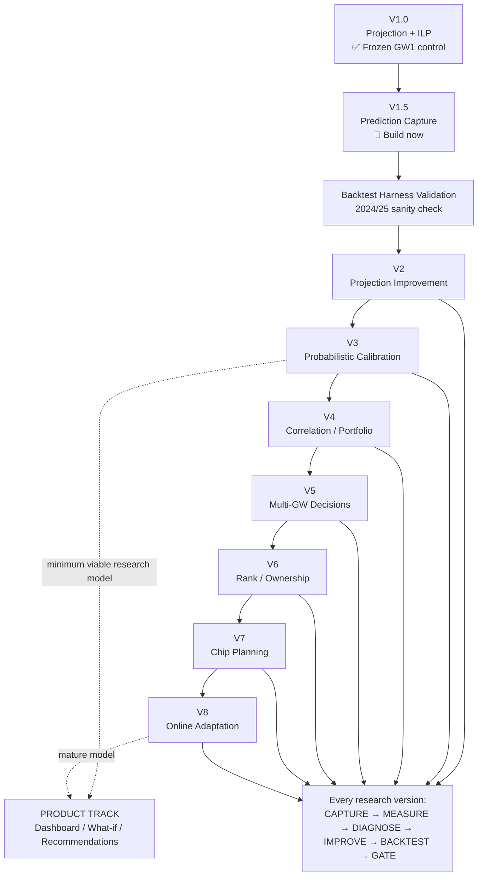
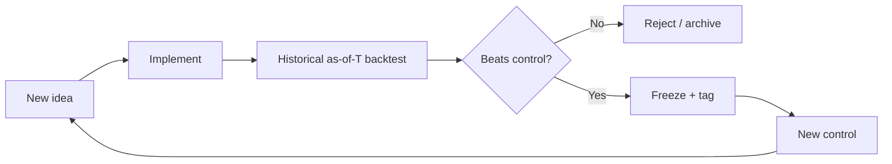

# FPL Model Roadmap

**Experiment log:** `docs/LAB_LOG.md` (hypotheses, completed tests, queued tests).

**Core methodology:**

> FREEZE → CAPTURE → MEASURE → DIAGNOSE → IMPROVE → BACKTEST → FREEZE

A new version is not "more complicated." A new version is a demonstrably better
component backed by out-of-sample evidence.

---

## Version map



---

## Version table

| Version | Main problem | Success criterion | Prerequisite | Status |
|---|---|---|---|---|
| **V1** | Transparent baseline | Works, legal, reproducible | None | ✅ Frozen GW1 2026/27 |
| **V1.5** | No prediction history | GW1 predictions captured before results | V1 | ✅ Active |
| **Historical Lab** | No validated backtest | Harness passes on 2024/25 + 2025/26 | V1.5 | 🔄 In progress |
| **V2** | Projection quality | Lower MAE / higher Spearman vs V1 | Validated harness | ⏳ |
| **V3** | Uncalibrated uncertainty | Better calibration / lower ECE | V2 | ⏳ |
| **V4** | Independence assumption | Better portfolio/risk decisions | V3 distributions | ⏳ |
| **V5** | Myopic decisions | Better realized transfer ROI | V4 | ⏳ |
| **V6** | Ignores competitive state | Better rank percentile | V5 | ⏳ |
| **V7** | No chip optimization | Better chip-adjusted season points | V6 | ⏳ |
| **V8** | Static model | Detect/correct calibration drift | V1.5 capture running | ⏳ |
| **V9** | Usability / product | Product-specific metrics | Separate track, V3 minimum | 🌐 |

---

## Version summaries

### V1.0 — Projection-first baseline ✅

**Status:** Frozen. Tagged `v1.0-gw1-baseline`. Permanent control for all future experiments.

**What it does:**
- Live FPL API ingest (bootstrap-static + fixtures), timestamped snapshot cache
- Event-rate projections: per-90 xG/xA, CS, DC, saves, bonus, appearance
- Minutes model: status + `ep_next` + within-club GK role ranking + cost priors
- Fixture model: FPL team-strength (2–5 scale) → match xG via hand-set ATK/CONCEDE
- Monte Carlo simulation (2500 sims / player / GW): μ, σ, P(10+), P90
- ILP optimizer: £100m, 2-5-5-3, ≤3 per club, bench-weighted objective
- Three strategies: safe (μ − 0.4σ), balanced (μ), aggressive (μ + 3·P10+)
- Audit script: leave-one-out Δ, four-baseline ILP comparison, Haaland lock/exclude

**Known limitations (from GW1 audit):**

| Limitation | Location | Evidence |
|---|---|---|
| New-club minutes inherited from old club | `minutes.py` | Guehi Δ = 1.94 (third-largest driver) |
| Attack/defence splits zero pre-season | `fixtures.py` | Coarse xG for elite-vs-weak |
| No captain-doubling in squad objective | `optimize.py` | 4.86 Haaland lock cost is a lower bound |
| Single-season per-90 as base | `project.py` | Noisy for new signings |
| Latent single-XI in horizon solve | `optimize.py` | Bench players may suppress premiums |

---

### V1.5 — Prediction capture 🔄

**Status:** Active. GW1 frozen to records/gw01_v1.0.csv.

**What it does:**
- Serialises frozen projections to `records/gw{N:02d}_v1.0.csv` before results land
- After GW results: fetches actuals and appends to produce a scoreable record
- Computes: MAE, RMSE, Spearman rank correlation, p_start calibration, P(10+) calibration

**Why it matters:** Without capture, every future evaluation is contaminated by
knowing the outcome first. Even a one-GW gap destroys the experiment.

**Usage:**
```bash
# Before deadline / kickoff — freeze the prediction
python -m engine.capture --gw 1

# After results are published — score it
python -m engine.capture --gw 1 --score
```


---

### Historical Lab — As-of-T backtesting 🔄

**Status:** Complete. Four-season E013 robustness panel: 2022/23, 2023/24, 2024/25, 2025/26.

**What it does:**
- Reconstructs Snapshot(as_of=GW_N) from Vaastav with strict information cutoff
- Validates no leakage before any freeze (engine.harness_validate)
- Writes predictions to records/historical/{season}/gw{nn}_v1.0.csv (same schema as live)
- Scores with shared metrics in engine/metrics.py

**Prerequisite for V2:** Met. Harness validated and rolling evaluation complete on all four seasons.

See docs/HARNESS_SPEC.md for field provenance, gates, and test ladder.
See docs/FORMAL.md for post-GW1 evaluation invariants (not a V2 gate).

---

### V2 - Projection improvement

**Prerequisite:** Met. V2A-M frozen; V2B is the active research question.

**Research ladder (each rung beats the preceding control out-of-sample before being retained):**

```text
V1.0 (permanent historical control)     tag: v1.0-gw1-baseline
  -> V2A-M  minutes / availability      FROZEN = v2am_s  tag: v2am-s-baseline
  -> V2B    multi-season rate priors (B4)   <-- next
  -> V2C    role-transition / transfer-specific minutes (B5)
  -> V2D    learned fixture coefficients (B6)
```

**V2A-M - Minutes / availability (FROZEN)**
Implementation: `minutes_version=v2am_s` — soft max 0.85; cold 0.55 / hot 0.72 from last-4 GW minutes post-GW4; no new-club prior; no bucket remap.
E015: XI 0-min roughly halved on all four seasons; XI+Cap / upper-tail / MAE_60+ all PASS.
**Do not retune.** Production default = `v2am_s`. V1 remains permanent historical control (harnesses pin `minutes_version=v1`).

**V2B / B4 — Multi-season shrinkage prior (E016 REJECT; E017 OPEN)**
E016 (`rates_v2b` full club prior): MAE/Sp ↑ 4/4; Cap/XI0 fail 2/4 — **REJECT.**  
E016b: concentrated club-prior μ promotion (FAIL = entered blank% > left blank%).  
**E017 (next):** `rates_v2b_d` with **α=0.50** mix of cost and club prior — dampen prior→XI lifts. Control still `v2am_s` + `rates=v1`. Minutes frozen.

**B5 — Role-transition minutes model**
Detect club changes via Vaastav per-GW history. Discount start prior by new-club
positional depth (count of teammates with ≥ 1800 mins). Note: generic new-club transfer status remains unresolved/confounded (E013). V2C targets the residual after V2A-M demonstrates general calibration improvement.
Success: better-calibrated p_start for new-club players, conditional on V2A-M already running.

**B6 — Learned fixture coefficients**
Replace hand-set ATK/CONCEDE with a Poisson GLM fitted from historical match data.
Success: lower fixture-xG RMSE than the hand-set table.

---

### V3 — Probabilistic calibration ⏳

Current Monte Carlo produces μ/σ/P(10+) but does not verify calibration.

Adds: reliability diagrams per probability bucket, ECE (Expected Calibration Error)
as a tracked metric, calibration comparison across model versions.

Success criterion: ECE(V3) < ECE(V2) on held-out GWs.

---

### V4 — Correlation-aware optimizer ⏳

Models Cov(P_i, P_j) — especially within-team CS covariance for defenders /
goalkeepers. Objective becomes E[P] − λ·portfolio_variance.

Makes the "triple Arsenal" question mathematically answerable rather than anecdotal.

Success criterion: better realized portfolio Sharpe ratio vs V3 squad.

Note: per-event-type covariance (CS vs goal/assist) matters more than a flat
player-level matrix. Scope this carefully.

---

### V5 — Multi-GW decision engine ⏳

Moves from squad-picker to decision-optimizer. Actions include roll, transfer,
hit, wildcard.

Bellman-style objective is intractable at full FPL state space; scope as a
truncated-horizon approximation (5–8 GWs, beam search over top-K squads).

Success criterion: better realized transfer ROI over a season vs V4 (naive
one-GW-ahead transfers).

---

### V6 — Rank-aware strategy ⏳

Introduces Effective Ownership (EO) and Differential Value (DV). Safe/Balanced/
Aggressive strategies gain formal definitions tied to rank target and mini-league
opponents.

Success criterion: better rank percentile outcomes in tracked leagues vs V5.

---

### V7 — Chip planning ⏳

Optimizes Wildcard / Free Hit / Bench Boost / Triple Captain timing over the
remaining season horizon. Requires DGW / BGW fixture awareness.

Success criterion: better chip-adjusted season points vs V6.

---

### V8 — Online adaptation ⏳

Weekly calibration monitoring: minutes error, xG error, xA error, CS error,
bonus error. Automatic comparison of recalibrated model vs current frozen version
before any update is accepted.

Prerequisite: V1.5 capture running continuously since GW1.

Success criterion: calibration drift detected and corrected without retrospective
data contamination.

---

### V9 — Product track 🌐

Separate from the research chain. Minimum research prerequisite: V3 (calibrated
uncertainty). Dashboard, what-if analysis, transfer recommendations, explainable
decisions.

Product-specific success metrics (engagement, decision accuracy for real users)
rather than out-of-sample MAE.

---

## Version gate



Every new version must answer: **what measurable weakness in the previous model
am I fixing, and did fixing it actually improve out-of-sample performance?**

Formal integrity (`docs/FORMAL.md`) is **not** a version gate. It checks that
the compare still measures the same question. Lean / property tests start after
GW1 (E012). They do not block V2A-M.

---

## Operational sequence for 2026/27 GW1

```
COMPLETED (pre-deadline, 2026-08-18/19)
  engine.audit --refresh    <- GW1 audit (Guehi IN, Haaland OUT decided)
  engine.capture --gw 1     <- GW1 prediction frozen to records/gw01_v1.0.csv
  E008/E009/E013            <- four-season research panel complete

FRI 21 AUG (deadline 17:30 UTC)
  Lock FPL squad: V1 balanced 15, Guehi IN, Haaland OUT, no overlay

AFTER GW1 RESULTS
  engine.capture --gw 1 --score    <- E010: score the frozen prediction

POST-GW1 (research)
  E010 live GW1 score (V1 control measurement)
  E014 REJECT (LOSO remap); E014b diagnostic; E015 PASS (structural minutes)
  V2A-M FROZEN = v2am_s (tag v2am-s-baseline); production default flipped
  E016 V2B REJECT; E016b concentrated (club-prior μ promotion)
  E017 pre-registered: rates_v2b_d α=0.50 prior dampening; implement next
```
