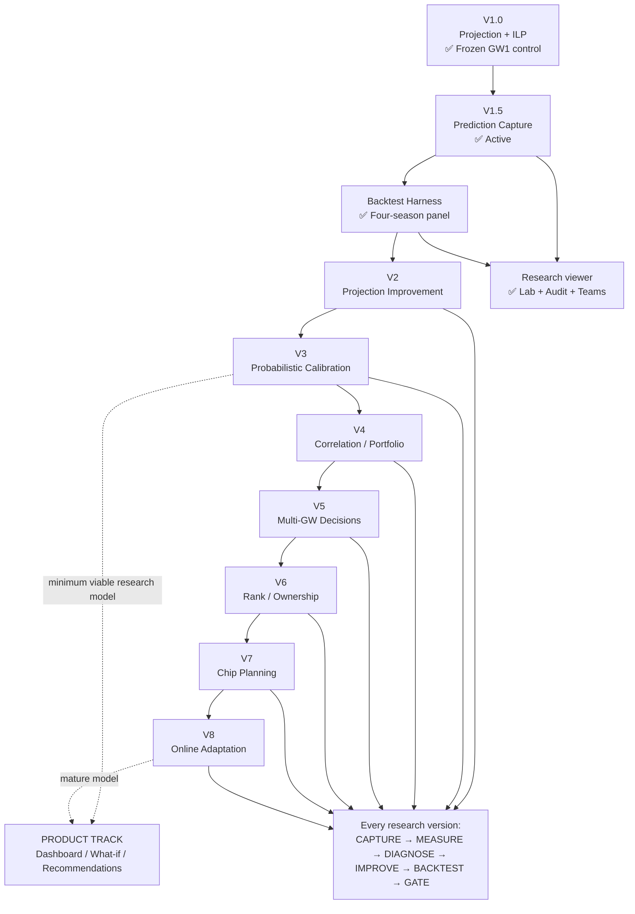
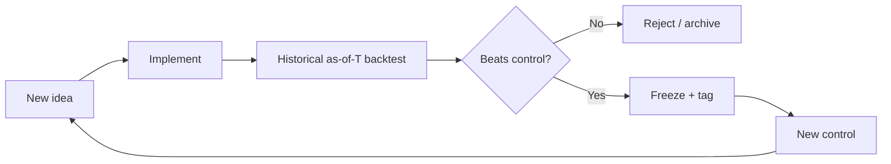

# FPL Model Roadmap

**Experiment log:** `docs/LAB_LOG.md` (hypotheses, completed tests, queued tests).

**Core methodology:**

> FREEZE → CAPTURE → MEASURE → DIAGNOSE → IMPROVE → BACKTEST → FREEZE

A new version is not "more complicated." A new version is a demonstrably better
component backed by out-of-sample evidence.

---

## Version map



---

## Version table

| Version | Main problem | Success criterion | Prerequisite | Status |
|---|---|---|---|---|
| **V1** | Transparent baseline | Works, legal, reproducible | None | ✅ Frozen GW1 2026/27 |
| **V1.5** | No prediction history | GW1 predictions captured before results | V1 | ✅ Active |
| **Historical Lab** | No validated backtest | Harness passes on 2024/25 + 2025/26 | V1.5 | ✅ Four-season E013 panel |
| **Research viewer** | Results not inspectable | Read-only UI over frozen records + live re-solve | V1.5 + Historical Lab | ✅ Shipped (`web/`) |
| **V2** | Projection quality | Lower MAE / higher Spearman vs V1 | Validated harness | ⏳ |
| **V3** | Uncalibrated uncertainty | Better calibration / lower ECE | V2 | ⏳ |
| **V4** | Independence assumption | Better portfolio/risk decisions | V3 distributions | ⏳ |
| **V5** | Myopic decisions | Better realized transfer ROI | V4 | ⏳ |
| **V6** | Ignores competitive state | Better rank percentile | V5 | ⏳ |
| **V7** | No chip optimization | Better chip-adjusted season points | V6 | ⏳ |
| **V8** | Static model | Detect/correct calibration drift | V1.5 capture running | ⏳ |
| **V9** | Usability / product | Product-specific metrics | Separate track, V3 minimum | 🌐 |

---

## Version summaries

### V1.0 — Projection-first baseline ✅

**Status:** Frozen. Tagged `v1.0-gw1-baseline`. Permanent control for all future experiments.

**What it does:**
- Live FPL API ingest (bootstrap-static + fixtures), timestamped snapshot cache
- Event-rate projections: per-90 xG/xA, CS, DC, saves, bonus, appearance
- Minutes model: status + `ep_next` + within-club GK role ranking + cost priors
- Fixture model: FPL team-strength (2–5 scale) → match xG via hand-set ATK/CONCEDE
- Monte Carlo simulation (2500 sims / player / GW): μ, σ, P(10+), P90
- ILP optimizer: £100m, 2-5-5-3, ≤3 per club, bench-weighted objective
- Three strategies: safe (μ − 0.4σ), balanced (μ), aggressive (μ + 3·P10+)
- Audit script: leave-one-out Δ, four-baseline ILP comparison, Haaland lock/exclude

**Known limitations (from GW1 audit):**

| Limitation | Location | Evidence |
|---|---|---|
| New-club minutes inherited from old club | `minutes.py` | Guehi Δ = 1.94 (third-largest driver) |
| Attack/defence splits zero pre-season | `fixtures.py` | Coarse xG for elite-vs-weak |
| No captain-doubling in squad objective | `optimize.py` | 4.86 Haaland lock cost is a lower bound |
| Single-season per-90 as base | `project.py` | Noisy for new signings |
| Latent single-XI in horizon solve | `optimize.py` | Bench players may suppress premiums |

---

### V1.5 — Prediction capture ✅

**Status:** Active. GW1 frozen and scored (`records/gw01_v1.0.csv`). Diagnostics
and audit CSVs exportable via `--diagnostics`.

**What it does:**
- Serialises frozen projections to `records/gw{N:02d}_v1.0.csv` before results land
- After GW results: fetches actuals and appends to produce a scoreable record
- Computes: MAE, RMSE, Spearman rank correlation, p_start calibration, P(10+) calibration

**Why it matters:** Without capture, every future evaluation is contaminated by
knowing the outcome first. Even a one-GW gap destroys the experiment.

**Usage:**
```bash
# Before deadline / kickoff — freeze the prediction
python -m engine.capture --gw 1

# After results are published — score it
python -m engine.capture --gw 1 --score
# After results are published — score it
python -m engine.capture --gw 1 --score

# Optional: sim quantiles, mu components, LOO/counterfactual CSV, per-strategy squads
python -m engine.capture --gw 1 --diagnostics
```

---

### Research viewer — read-only UI ✅

**Status:** Shipped in `web/`. Exports from `scripts/export_ui.py`; never writes
`records/`.

**What it does:**
- **Pool** — frozen prediction pool (V1 control μ/σ) for the live season
- **XI board** — historical V1 vs B0 vs oracle; live season = strategy re-solve
- **Lab** — six chart families from four-season artifacts (E013 panel, leakage, regret)
- **Audit** — LOO delta, lock/exclude counterfactuals, sim quantiles, boom-or-bust quadrant
- **Teams** — track public entries, pitch preview, rival compare, GW edge
- **My team** — signed-in FPL session (picks, transfers, mini-leagues); research caveats apply

**Model provenance:** UI labels **frozen record** vs **live re-solve** via
`engine/model_config.py` → `manifest.json` (`production` vs `controls.v1_gw1_baseline`).
Frozen GW1 pool stays V1 even when production runs `v2am_fpla`.

See `web/README.md` for deploy, export cadence, and colour law.

---

### Historical Lab — As-of-T backtesting ✅

**Status:** Complete. Four-season E013 robustness panel: 2022/23, 2023/24, 2024/25, 2025/26.

**What it does:**
- Reconstructs Snapshot(as_of=GW_N) from Vaastav with strict information cutoff
- Validates no leakage before any freeze (engine.harness_validate)
- Writes predictions to records/historical/{season}/gw{nn}_v1.0.csv (same schema as live)
- Scores with shared metrics in engine/metrics.py

**Prerequisite for V2:** Met. Harness validated and rolling evaluation complete on all four seasons.

See docs/HARNESS_SPEC.md for field provenance, gates, and test ladder.
See docs/FORMAL.md for post-GW1 evaluation invariants (not a V2 gate).

---

### V2 - Projection improvement

**Prerequisite:** Met. V2A-M frozen; club-prior rate family retired (E018s = **B**).

**Research tree (parallel branches, not a forced ladder):**

```text
V2A-M / v2am_fpla + rates_v1     ✅ production baseline (E044-A promote)
V2A-M / v2am_s                   pre-fpla minutes control / ablation
  │
  ├── Rate research
  │     E016 → E017 → E018 → ❌ club-prior family retired (E018s: B)
  │     └── Packaging rates_v2b vs prod  ❌ E024 REJECT (XI0✓ Cap✗); E024b = valuation
  │
  ├── Minutes / role research
  │     V2C role-transition P(start)   ❌ E019/E020 REJECT (threshold family frozen)
  │
  └── Fixture research
        V2D learned ATK/CONCEDE          ❌ E021 REJECT (MAE✓ Cap/XI0✗; fixtures stay v1)
        └── Packaging (decision U)       ✅ E022 PASS vs raw v2d
              └── vs production v1       ❌ E023 REJECT (XI0✗ 4/4; not promote)
```

**V2A-M - Minutes / availability (FROZEN)**
Implementation: `minutes_version=v2am_s` — soft max 0.85; cold 0.55 / hot 0.72 from last-4 GW minutes post-GW4; no new-club prior; no bucket remap.
E015: XI 0-min roughly halved on all four seasons; XI+Cap / upper-tail / MAE_60+ all PASS.
**Do not retune `availability()`.** Production default = `v2am_fpla` (E044-A).
`v2am_s` remains the pre-fpla minutes control. V1 remains permanent historical
control (harnesses pin `minutes_version=v1`).

**V2B / rates — Club-prior family (RETIRED after E018s)**
E016/E017/E018 all improved MAE/Sp; decision gates never clean. E018s: information useful but unsafe under ILP (**B**). **rates stay v1.** Packaged rates (E024/E024b) cleared XI0 but Cap remains valuation error among reliable players — not fixed by prior retunes or q.

**V2C — Role-transition minutes (E019/E020 REJECT)**
E019 competition demotion: XI0↑ 4/4; Cap fail 2/4. E019b: false-positive targeting. E020 cold-eligible (`recent4<90`): Cap fail reduced to 1/4; MAE still fail 4/4. **minutes stay `v2am_s`.** No further recent4-threshold cards without a new structural hypothesis.

**V2D — Learned fixture coefficients (E021 REJECT; E021b/c)**
E021: MAE✓ Cap/XI0✗. E021b: rates-like toxicology. E021c: cold cell = mostly non-playing (61% zeros). **fixtures stay v1.**

**Packaging — Decision-safe μΔ (CLOSED after E024b)**
Mechanism validated (E022). Does not clear production promote bars (E023 XI0; E024 Cap).
**Reach ends:** availability risk only. E024b movers already at `q≈1` and still wrong picks — valuation/selection among players who play, not dosage. No q/α fishing. Production unchanged.

**Valuation / selection (E025–E030)**
E029 concentrated (negative): selection-packaging closed (E022 availability separate).
E030 concentrated (negative): portfolio alignment poor on FAIL; objective-interface research earned.
**E031 concentrated:** sign flip XI-level on FAIL; captain secondary.
**E032 concentrated:** μ inversion on FAIL; not utility transform; squad_xi_agree=100%.
**E033 concentrated:** wrong-15 pool dominates FAIL; treat rank on ctrl 15 neutral.
**E034 concentrated:** budget displacement; entrants OK individually; vs_leaver −0.5 on FAIL.
**E034b concentrated:** force one entrant → full treat 15; Δ_cascade=0.
**E034c concentrated:** layered pair displacement + re-equilibration; G_treat explains tripwire; chain closed.
**E035 concentrated:** g_treat cluster discriminates portfolio_bad; proxies collinear; MC hypothesis earned.
**E036 / H-MC1 concentrated (negative):** MC ≡ U at boundary; V(S) spec earned.
**E037 concentrated (negative):** V_B ≈ V_A; both anti-align on FAIL.
**Charter + E038:** Landing A; `docs/DECISION_CHARTER.md`.

**Phase 0 (2026-09-04) — permanent boundary + forked roadmap**

```text
Production:        v2am_fpla + rates=v1 + fixtures v1
                   (v2am_s = pre-fpla minutes control; V1 = permanent historical)
Closed research:   rates_v2b; E021/E048/E049 fixture remap families; …
Parked:            E051 joint inventory; E057 Cap claim under FLEX (XI0✗); …
Upstream NEXT:       continuous relative-strength → xG CLOSED (E052+E053)
Research NEXT:       none — lane at rest (E057 PARK; no immediate successor)
Product SHIPPED:     TC/BB/FH/WC independent wired surfaces
```

```text
                   E038
                    │
        ┌───────────┼────────────┐
        │           │            │
   RESEARCH      UPSTREAM      PRODUCT
        │           │            │
      E039       Role/Minutes   Chips
   V(S,z,F)      decision gate  action ROI
   regret first                 frozen μ
        │           │            │
        └───────────┼────────────┘
                    │
              only successful branches → Transfers → Full season agent
```

**Policy:** prediction without decision improvement = kill. One implement lane at a time.
Do not collapse into a linear `E039 → E040 → …` ladder. Details: `docs/DECISION_CHARTER.md`.

**E039 preregistered (2026-09-04):** Research lane active. Structural non-separable
\(V(S,z,F)\); precise null = not monotone-equivalent to \(U\), **and** better decision
ranking. First artifact = counterfactual regret evaluator. Upstream/Product parked.
No ILP / new μ / production changes. See `docs/LAB_LOG.md` E039; charter §15.

**E039-A candidate frozen (2026-09-04):**
\(V_{\mathrm{ns}}(S)=\sum_{XI} U_i - 0.5\sum_f\binom{n_f}{2}\);
\(f\) = PL match in GW \(T\); E036-style units; no \(\lambda\) sweep.
**Result: KILL** (novelty yes; decision-fail). Phase-0 fork open.

**E040 preregistered (2026-09-05):** Product lane — Triple Captain ROI.
B0 never-TC / B1 fixed-\(g^\star\) (no \(U\)) / C \(\arg\max_t U_{\mathrm{capt}}(t)\).
B1 ≠ C. \(W=\{1..38\}\). Amendment freezes \(g^\star\) before run. See charter §17.

**E040-A / gate (2026-09-05):** \(g^\star=20\); **SURVIVES** AGG+FAIL
(ΣR(C)=8275 > B0 8218 and > B1 8251; FAIL robust). Wiring not auto-promoted.

**E040-A product wired (2026-09-05):** `engine.e040_tc_policy` + `fpl.py tc`.
Frozen claim only. Next: E041-BB prereg.

**E041 preregistered (2026-09-05):** Bench Boost ROI — B0 never-BB / B1 fixed-\(g^\star\) /
C \(\arg\max_t U_{\mathrm{bench}}(t)\). B1 ≠ C. Amendment before evaluator. See charter §20.

**E041-A / gate (2026-09-05):** \(g^\star=20\); **SURVIVES** AGG+FAIL
(ΣR(C)=8300 > B0/B1; FAIL robust; C>B1 every season). Wiring not auto-shipped.

**E041-A product wired (2026-09-05):** `engine.e041_bb_policy` + `fpl.py bb`.
Both TC and BB surfaces frozen. No FH/WC without new prereg.

**Product hardening (2026-09-05):** TC/BB CLI+JSON state independence (not a joint
chip calendar). Chip lane paused.

**E042 preregistered (2026-09-05):** Upstream — as-of-T **club–position minutes share**.
Minutes path only; rates/fixtures/ILP/chips fixed; player-level + FAIL Cap + `g_treat`;
MAE-only = kill. Not E019/E020/`recent4` reopen. Amendment freezes \(W\) + map before code.
See `docs/LAB_LOG.md` E042; charter §24.

**E042-A freeze (2026-09-05):** \(W=4\), \(\lambda=0.35\), adjust-not-replace on `v2am_s`
base; identity on thin/transfer/zero-denom; availability unchanged; gates XI0+MAE_60++FAIL Cap.
Implement `v2am_share` next — no retune after peek.

**E042-A gate (2026-09-05):** **KILL** — XI0 fails 2022-23; MAE worsens 4/4; FAIL Cap
fails 2022-23. Production stays `v2am_s`. No λ/W fishing.

**E042-A family CLOSED (2026-09-06):** Club–position recent-minutes-share adjustments to
\(p_{\mathrm{start}}\) closed under current stack (any \(W\)/\(\lambda\)/caps/blend shape
on that observable). Reopen only with a distinct as-of-T causal signal.

**E043 preregistered (2026-09-06):** Upstream — **PL schedule-pressure → minutes**.
PL-only fixtures/kickoffs as-of-T; cups/Europe out of scope; minutes path only;
same hard gates as E042-A. Amendment freezes windows/eligibility/map before code.
See `docs/LAB_LOG.md` E043; charter §25.

**E043 provenance (2026-09-06):** **PASS_WITH_CAVEAT** — kickoffs OK; order OK;
static `fixtures.csv` caveat. Next: E043-A amendment (not code yet).

**E043-A freeze (2026-09-06):** **Lagged short-turnaround load** —
\(d_{\mathrm{prev\_gap}}=(\mathrm{prior}-\mathrm{prior2}).\mathrm{total\_seconds}()/86400\)
with both KOs `event < T`; trigger \(<5.0\)d → `b1=min(b0,0.60)` for outfield
minutes≥800. No target-GW KO. Treat `v2am_sched`. Implement next.

**E043-A gate (2026-09-06):** **KILL** — XI0/MAE/FAIL-Cap miss. Production stays
`v2am_s`. No 5.0/0.60/800 retune.

**E043-A family CLOSED (2026-09-06):** Lagged PL short-turnaround-gap demotions of
\(p_{\mathrm{start}}\) (completed PL KOs only) closed — no gap/cap/eligibility/map
variants on that observable. Reopen needs a distinct signal (+ dated fixture book
if target-fixture timing).

**E045-A KILL + family CLOSED (2026-09-06):** Dated fplcache `ep_next` μ-blend
(`rates=v1_ep`, λ=0.35) killed — XI0 regress on 2023-24; FAIL Cap regress on
2025-26. No λ/`ep_this`/Vaastav reopen on that map. Production stays
`v2am_fpla` + `rates=v1`. Strengths-drift and fixture-book remain separate
parked cards. See `docs/LAB_LOG.md` E045-A gate; charter §29.

**E049-A KILL + family CLOSED (2026-09-06):** Piecewise continuous through all
four ATK/CONCEDE knots (`v1_pw`) killed — XI0 regress on 2022-23 and 2023-24
despite MAE/FAIL Cap/AGG improves. Not identity-null. No LO/HI or knot fishing.
Production stays `fixtures=v1`. See `docs/LAB_LOG.md` E049-A gate; charter §34.

**E050-A SURVIVES + wired (2026-09-09):** Wildcard ROI — sticky **replace**; forward
\(U_{\mathrm{WC}}\); AGG C−B1 = **+247**. Product surface: `fpl.py wc`. See
`docs/LAB_LOG.md` E050-A gate/wiring; charter §35.

**Product milestone (2026-09-09):** All four individual chip policies SHIPPED
(TC/BB/FH/WC), independent, μ/squad ILP unchanged. Continuous-remap family
CLOSED (E048/E049). Mid-season strength drift PARKED (E045).

**E051 preregistered (2026-09-09):** Joint-chip **conflict diagnostic**
(measurement only; frozen chip recommenders as inputs). No joint scheduler
until conflicts prove material → optional E051-A. See `docs/LAB_LOG.md` E051;
charter §36.

**E051 diagnostic (2026-09-09):** **CONFLICTS_PRESENT (sparse)** — 1/4 seasons
(TC∩FH @36 in 2025-26); hard FH∩WC = 0. **PARK joint inventory**; skip E051-A.
See `docs/LAB_LOG.md` E051 diagnostic.

**E052 preregistered (2026-09-09):** Continuous relative strength→xG (bypass
ATK/CONCEDE; not E047/E048/E049). Control = production `v2am_fpla`+`v1`+`v1`.
Phase-1 projection (MAE_60+) before any decision Cap.

**E052-A freeze (2026-09-09):** `fixtures=v1_sxg`;
\(e_h=1.35\cdot(I_h/I_a)\cdot1.10\), \(e_a=1.35\cdot(I_a/I_h)\cdot0.88\);
dated fplcache hydrate on treat; clamp unchanged.

**E052-A Phase-1 (2026-09-09):** **SURVIVES** — MAE_60+ 4/4; Spearman AGG
0.208→0.227; n_mu_delta=87873.

**E052-A Phase-2 (2026-09-09):** **KILL** — XI0 worsens 4/4; 2025-26 FAIL Cap
also misses, despite AGG Cap improving. Do not promote `v1_sxg`; keep
production at fixtures `v1`.

**E053 preregistered (2026-09-09):** Dated **attack/defence** strengths →
continuous relative xG (`v1_adxg`).

**E053-A Phase-1 (2026-09-09):** **SURVIVES** — MAE_60+ 4/4; Spearman AGG↑.

**E053-A Phase-2 (2026-09-09):** **KILL** — XI0 worsens 3/4; FAIL Cap and AGG
Cap clear. Do not promote `v1_adxg`. **Family close:** continuous
relative-strength → xG = CLOSED (E052-A + E053-A). Discrete/piecewise remap
remains separately CLOSED (E048/E049).

**E054 preregistered (2026-09-09):** μ→XI decision-boundary mechanism diagnostic.

**E054-A (2026-09-09):** **CONCENTRATED → BUDGET_FLEX** (92.9% of primary
XI0-harm blank enters).

**E055 preregistered (2026-09-10):** Constraint-induced **portfolio cascade**
under frozen `v1_adxg` vs production. Phase-1: companions vs primary mover blank
share. Phase-2: μ-fixed counterfactuals only if Phase-1 concentrates. Hard
non-identity vs E034c/E035/E036/E039-A. **No new objective.**

**E055-A (2026-09-12):** Freeze locked — primary=max ΔU_cand same-pos pair;
companions=other enters; companion_blank_share≥0.50 AGG; CF_PAIR / CF_HOLD
recipes frozen for gated Phase-2.

**E055 Phase-1 (2026-09-12):** **SURVIVE** — companion_blank_share **60.7%**
(17/28 on M). All four seasons ≥50%.

**E055 Phase-2 (2026-09-12):** **BRANCH** — CF_PAIR and CF_HOLD both recover
AGG XI0 on xi0_worse (43→27); Cap +~100. Cascade card closes as BRANCH.

**E056 preregistered (2026-09-12):** Valuation / **opportunity-cost** of full
ILP cand XI vs μ-fixed CF_PAIR/CF_HOLD; Phase-1 OC descriptive; Phase-2
ex-ante MENU rule only if material. Hard non-identity vs E034c/E039-A/E055.
**No new ILP objective / no CF promote.**

**E056-A (2026-09-12):** Freeze locked — OC signs (+ = alt better); MATERIAL =
mean OC_CAP(HOLD)>0 ∧ OC_XI0(HOLD)>0 on xi0_worse; MENU={ctrl,cand,PAIR,HOLD};
RULE_UMAX (ties HOLD>PAIR>ctrl>cand); `v1_adxg` = E053 KILL diagnostic
reference only.

**E056 Phase-1 (2026-09-12):** **SURVIVE MATERIAL** — xi0_worse n=23; mean
OC_CAP(HOLD)=**+4.30**; mean OC_XI0(HOLD)=**+0.70**; PAIR twin ≈ HOLD.

**E056 Phase-2 (2026-09-12):** **BRANCH** — RULE_UMAX Cap 1360>1308; XI0 36≤43
on worse (hold=10/pair=4/cand=9). Valuation card closes as BRANCH.
**No RULE/CF/adxg promote.**

**E057 preregistered (2026-09-12):** Decision-rule / **product-surface** for
frozen RULE_UMAX. **Guardrail:** `xi0_worse` ≠ live trigger.

**E057-A (2026-09-12):** ELIGIBLE = XI_cand≠XI_ctrl ∧ FLEX_flag; live HOLD
deferred. Phase-1 **SURVIVE** (n_eligible=122). Phase-2 **PARK** — Cap +40 on
ELIGIBLE but XI0 81>79. Card closed; Research lane **at rest** (no immediate
successor). See `docs/LAB_LOG.md` E057-A Phase-2; charter §42.

---

### V3 — Probabilistic calibration ⏳

Current Monte Carlo produces μ/σ/P(10+) but does not verify calibration.

Adds: reliability diagrams per probability bucket, ECE (Expected Calibration Error)
as a tracked metric, calibration comparison across model versions.

Success criterion: ECE(V3) < ECE(V2) on held-out GWs.

---

### V4 — Correlation-aware optimizer ⏳

Models Cov(P_i, P_j) — especially within-team CS covariance for defenders /
goalkeepers. Objective becomes E[P] − λ·portfolio_variance.

Makes the "triple Arsenal" question mathematically answerable rather than anecdotal.

Success criterion: better realized portfolio Sharpe ratio vs V3 squad.

Note: per-event-type covariance (CS vs goal/assist) matters more than a flat
player-level matrix. Scope this carefully.

---

### V5 — Multi-GW decision engine ⏳

Moves from squad-picker to decision-optimizer. Actions include roll, transfer,
hit, wildcard.

Bellman-style objective is intractable at full FPL state space; scope as a
truncated-horizon approximation (5–8 GWs, beam search over top-K squads).

Success criterion: better realized transfer ROI over a season vs V4 (naive
one-GW-ahead transfers).

---

### V6 — Rank-aware strategy ⏳

Introduces Effective Ownership (EO) and Differential Value (DV). Safe/Balanced/
Aggressive strategies gain formal definitions tied to rank target and mini-league
opponents.

Success criterion: better rank percentile outcomes in tracked leagues vs V5.

---

### V7 — Chip planning ⏳

Optimizes Wildcard / Free Hit / Bench Boost / Triple Captain timing over the
remaining season horizon. Requires DGW / BGW fixture awareness.

Success criterion: better chip-adjusted season points vs V6.

---

### V8 — Online adaptation ⏳

Weekly calibration monitoring: minutes error, xG error, xA error, CS error,
bonus error. Automatic comparison of recalibrated model vs current frozen version
before any update is accepted.

Prerequisite: V1.5 capture running continuously since GW1.

Success criterion: calibration drift detected and corrected without retrospective
data contamination.

---

### V9 — Product track 🌐

Separate from the research chain. Minimum research prerequisite: **V3** (calibrated
uncertainty). Full product: dashboard, what-if analysis, transfer recommendations,
explainable decisions.

**Partial today (not V9):** Teams tracker, signed-in **My team**, and live strategy
re-solve are convenience layers on top of the research viewer. They do not replace
the V3 calibration gate for advice-shaped features.

**Model A freeze (2026-09-13):** production stack is locked as the product
baseline — `v2am_fpla` + `rates=v1` + fixtures `v1` + existing `solve_squad`
horizon objective + XI/C + existing `suggest_transfers`. Do not retune μ or
the ILP because outputs feel wrong. Not E058.

**k-best closed (2026-09-13):** natural no-good-cut enumeration is
**insufficient** for a candidate-menu UI (verdict B + C pockets, not A).
That is a *mechanism* failure, not a product-concept close. Keep
`engine/candidates.py` (generation → pool → diagnostics).

**Preference-conditioned Model A (v0, 2026-09-13):** decision alternatives
via hard constraints only — LOCK/BAN (element_id), BANK ∈
{0,0.5,1.0,1.5,2.0}m, CLUB max ∈ {0,1,2}. Same \(U\); only \(\mathcal F\)
changes. UI: `/me/model-a`. CLI: `fpl.py prefs`. Not ROBUST/FLEX/UPSIDE.
Amber (minutes cuts, scenarios, soft prefs) deferred.

Product-specific success metrics (engagement, decision accuracy for real users)
rather than out-of-sample MAE.

---

## Version gate



Every new version must answer: **what measurable weakness in the previous model
am I fixing, and did fixing it actually improve out-of-sample performance?**

Formal integrity (`docs/FORMAL.md`) is **not** a version gate. It checks that
the compare still measures the same question. Lean / property tests start after
GW1 (E012). They do not block V2A-M.

---

## Operational sequence for 2026/27 GW1

```
COMPLETED (pre-deadline, 2026-08-18/19)
  engine.audit --refresh    <- GW1 audit (Guehi IN, Haaland OUT decided)
  engine.capture --gw 1     <- GW1 prediction frozen to records/gw01_v1.0.csv
  E008/E009/E013            <- four-season research panel complete

FRI 21 AUG (deadline 17:30 UTC)
  Lock FPL squad: V1 balanced 15, Guehi IN, Haaland OUT, no overlay

AFTER GW1 RESULTS
  engine.capture --gw 1 --score    <- E010: score the frozen prediction

POST-GW1 (research)
  E010 live GW1 score (V1 control measurement)
  E014 REJECT (LOSO remap); E014b diagnostic; E015 PASS (structural minutes)
  V2A-M FROZEN = v2am_s (tag v2am-s-baseline); production default flipped
  E019 REJECT (v2c): XI0↑ 4/4 but Cap fail 2/4, MAE guardrail fail 4/4; minutes stay v2am_s
  E019b concentrated: Cap-fail demoted leavers high value-when-playing (false positives)
  E020 REJECT (v2c_e cold-eligible): Cap better (1 fail) but MAE✗ 4/4; minutes stay v2am_s
  E021 REJECT (fixtures_v2d): MAE✓ 4/4 Cap/XI0✗ 4/4; fixtures stay v1; no multiplier fishing
  E021b concentrated: fixture movers = rates toxicology (cold prior_str blank 61%); packaging next
  E021c mostly non-playing: cold 61% zeros; cold 60+ outscore treat mu; preregister packaging
  E022 PASS (packaged U vs raw v2d): Cap+XI0 4/4; MAE identity; do not promote fixtures
  E023 REJECT (packaged v2d vs production): MAE✓ Cap mostly✓ XI0✗ 4/4; fixtures stay v1; no q fishing
  E012 PASS: evaluation integrity property tests (9/9)
  E024 REJECT (packaged rates_v2b vs production): MAE✓ XI0✓ Cap✗ toxic seasons; rates stay v1
  E024b concentrated: Cap = valuation among reliable players (q≈1); packaging arc closed
  E025 concentrated: Cap-FAIL swap concordance ~47% vs PASS ~75% (both60); ranking not blanks
  E026 concentrated: FAIL rank_err ~91% near+mid ctrl gaps → H-PACK1 stability branch
  E027 REJECT (H-PACK1 stability): 1/4 PASS; binds 13-30%; no ε retune
  E028 REJECT (local branch): bad swaps margin-agnostic on FAIL; no H-PACK2 near-margin
  E029 concentrated (negative): selection-packaging closed; q(dmu) not supported
  E030 concentrated (negative): corr(dU,dCap) negative on FAIL; objective-interface earned
  E031 concentrated: XI-level sign flip on FAIL; captain secondary; oracle does not fix
  E032 concentrated: mu inversion on FAIL; oracle XI still negative; squad pipeline OK
  E033 concentrated: wrong-15 pool dominates FAIL; ranking on ctrl 15 neutral
  E034 concentrated: budget displacement signal; not toxic entrant; vs_leaver FAIL -0.5
  E034b concentrated: single forced entrant reproduces full treat; cascade residual 0
  E034c concentrated: layered pair + re-equilibration; G_treat tripwire; displacement chain closed
  E035 concentrated: g_treat cluster AUROC 0.73 FAIL; replacement/budget weak; MC hypothesis
  E036/H-MC1 concentrated (negative): MC identical to U; V(S) payoff model next
  E037 pre-registered: V_A vs V_B alignment (descriptive)
  E037 concentrated (negative): V_B does not beat V_A; both anti-align FAIL
  DECISION_CHARTER: Landing A (E038 concentrated)
  E038 concentrated: both season arms negative FAIL; Landing B rejected
  Phase 0: rates_v2b promote CLOSED; fork Research|Upstream|Product; one lane
  E039 preregistered: structural V; regret evaluator first; Upstream/Product parked
  E039-A: V_ns fixture-concentration λ=0.5 frozen; fail = kill candidate only
  E039-A KILL: novelty 27% disagree; spearman V worse than U on FAIL; fork open
  E040 preregistered: Product TC ROI; B0/B1-fixed-g*/C-argmax-U; B1≠C
  E040-A: g*=20 frozen; SURVIVES AGG+FAIL; wiring not auto-promoted
  E040-A wired: fpl.py tc / e040_tc_policy; E041-BB next prereg
  E041 preregistered: BB ROI; B0/B1-fixed-g*/C-argmax-U_bench; B1≠C
  E041-A: g*=20; SURVIVES AGG+FAIL; wiring not auto-shipped
  E041-A wired: fpl.py bb / e041_bb_policy; TC+BB surfaces frozen
  Product: TC/BB independence disclaimer; chip lane paused
  E042 preregistered: upstream club–position minutes share; amendment before code
  E042-A freeze: W=4 λ=0.35 adjust-on-v2am_s; implement v2am_share next
  E042-A KILL: XI0/MAE/FAIL-Cap miss; production stays v2am_s; no λ/W retune
  E042-A family CLOSED: club–position recent-minutes-share; distinct signal to reopen
  E043 preregistered: PL schedule-pressure → minutes; amendment before code
  E043 provenance PASS_WITH_CAVEAT; E043-A amendment next
  E043-A freeze: lagged short-turnaround d_prev_gap; v2am_sched next
  E043-A KILL: XI0/MAE/FAIL-Cap miss; production stays v2am_s; no threshold retune
  E043-A family CLOSED: lagged PL short-turnaround-gap; distinct signal to reopen
  E044 preregistered: decision-time availability-source feasibility (provenance only)
  E044 survey PASS: Randdalf/fplcache 152/152 pre-deadline; E044-A next
  E044-A freeze: v2am_fpla = fplcache hydrate → existing availability(); gate next
  E044-A SURVIVES + promoted: v2am_fpla production default; XI0/MAE/FAIL-Cap/AGG clear
  Tier-1: doc drift fixed to v2am_fpla; live availability_monitor in capture diagnostics
  E045 preregistered: rates/fixtures archival feasibility (provenance only; not derived reopen)
  E045 survey PASS: fplcache ep_next (152/152); strengths drift; no fixture book in bootstrap
  E045-A freeze: rates=v1_ep = (1-λ)μ0+λ·ep_next, λ=0.35; not Vaastav xP; gate next
  E045-A KILL + family CLOSED: XI0✗ 2023-24; FAIL Cap✗ 2025-26; production stays rates=v1
  E046 preregistered: FH-only; sticky-held/0-FT; U_FH=XI lift; WC out; degeneracy lock
  E046-A freeze: g*=20; U_FH=next_xi_utility blank-held; evaluator next
  E046-A SURVIVES: AGG+FAIL clear (C beats B1 by +2 AGG); FH unwired (fragile)
  E046-A wired: fpl.py fh / e046_fh_recommend; WC next in product order
  E047-A freeze: fixtures=v1_fpls = dated strength_overall replace; not v2d; gate next
  E047-A SURVIVES identity-null + CLOSED: _str clamps all overall to 5; no promote
  E048-A freeze: v1_sfix = linear 1000..1350→{2..5}; control=_str→5; no Cap peek
  E048-A KILL + CLOSED: XI0✗ 3/4; FAIL Cap✗ 2025-26; not identity-null; no LO/HI retune
  E049-A freeze: v1_pw = piecewise through 4 ATK/CONCEDE knots; no Cap peek
  E049-A KILL + CLOSED: XI0✗ 2/4; MAE/FAIL Cap/AGG✓; not identity-null; no knot fishing
  E050 preregistered: WC-only; sticky replace (not FH revert); forward U_WC
  E050-A freeze: g*=20; U_WC=sum remaining XI lifts under I_t; no Cap peek
  E050-A SURVIVES: AGG C−B1=+247; FAIL clear; WC unwired (optional wire)
  E050-A wired: fpl.py wc / e050_wc_recommend; per-season B1 asterisks in CLI
  Product milestone: TC/BB/FH/WC all SHIPPED independent; μ/ILP unchanged
  E051 preregistered: joint-chip conflict diagnostic (measurement; no scheduler)
  E051 diagnostic: CONFLICTS_PRESENT sparse (1/4; TC-FH@36 2025-26; hard FH-WC=0)
  E051 PARKED: skip E051-A; joint inventory closed for now
  E052 preregistered: continuous relative strength→xG; Phase-1 MAE before Cap
  E052-A freeze: v1_sxg; e=1.35*(I_rel)*{1.10,0.88}; dated hydrate; no ATK
  E052-A Phase-1 SURVIVES: MAE60 4/4; Sp AGG↑; n_mu_delta=87873
  E052-A Phase-2 KILL: XI0 worsens 4/4; FAIL Cap✗ 2025-26; AGG Cap✓
  E053 preregistered: dated attack/defence → continuous relative xG
  E053-A freeze: v1_adxg; I_atk/I_def relative; dated overlay; no overall
  E053-A Phase-1 SURVIVES: MAE60 4/4; Sp AGG↑; n_mu_delta=87831
  E053-A Phase-2 KILL: XI0✗ 3/4; FAIL Cap✓; AGG Cap✓
  FAMILY CLOSE: continuous relative-strength → xG (E052-A + E053-A)
  E054 preregistered: μ→XI decision-boundary diagnostic (mechanism forbidden)
  E054-A freeze: E026 gaps; BLANK_P60=0.50; BUDGET_FLEX>BLANK>NEAR>DIFFUSE
  E054-A BRANCH=BUDGET_FLEX (92.9% primary harm) → ILP/portfolio family
  E055 preregistered: constraint-induced portfolio cascade under frozen adxg
  E055-A freeze: mover=max ΔU_cand pair; companions; share≥0.50; CF_PAIR/HOLD
  E055 Phase-1 SURVIVE: companion_blank_share=60.7% (17/28); all seasons ≥50%
  E055 Phase-2 BRANCH: CF_PAIR+HOLD XI0 43→27 on worse; Cap +~100; no promote
  E056 preregistered: valuation/opportunity-cost of cand vs CF (ex-ante RULE gated)
  E056-A freeze: OC+/MATERIAL HOLD; MENU; RULE_UMAX; adxg=diagnostic not reopen
  E056 Phase-1 SURVIVE: xi0_worse n=23; OC_CAP(HOLD)=+4.30; OC_XI0=+0.70
  E056 Phase-2 BRANCH: RULE Cap +52 vs cand; XI0 43→36; hold/pair/cand mix
  E057 preregistered: product-surface RULE_UMAX; xi0_worse ≠ live trigger
  E057-A freeze: ELIGIBLE=FLEX; live HOLD deferred
  E057 Phase-1 SURVIVE: n_eligible=122; ∩worse=21/23 report-only
  E057 Phase-2 PARK: ELIGIBLE Cap+40 but XI0 81>79; ∩worse still Cap+52
  E057 CLOSED PARK: Research lane at rest — no immediate successor
  NEXT: none (later return needs fresh prereg with higher bar)
  NOT NEXT: immediate E058; adopt RULE globally; silent FLEX retune; touch production
  PRODUCT (2026-09-13): Model A freeze; k-best landscape diagnostic next
    (squad only; live snapshot then 12 historical; A/B/C honesty gate, not a card)
  PRODUCT k-best verdict: B with C pockets (not A) — labeled menu not earned;
    Phase 2 UI parked; no E058
  PRODUCT k-best CLOSED: natural enumeration insufficient (mechanism, not concept);
    keep candidates.py; next = design discussion only; no Hamming-force generator
  PRODUCT prefs v0 (2026-09-13): LOCK/BAN/BANK/CLUB → same U re-solve;
    fpl.py prefs + /me/model-a; Hamming/risk objectives still rejected

  LIVE OPS (2026-09-18)
  GW5 freeze pre-deadline (17:30 UTC): records/gw05_v1.0.csv (n=659)
  + gw05_diagnostics.json; export_ui refreshed (2026-27 has GW1+GW5)
  capture.py fix: restore load_snapshot import; drop dead
    include_finished_fixtures kwarg
  Gap: GW2–4 never frozen — do not invent post-hoc freezes
  NEXT ops: capture --gw 5 --score after results; resume weekly freeze cadence
  PRODUCT hardening (2026-09-18): SquadInfeasibleError vs SquadSolverError;
    Optimal-only accept in solve_squad / solve_xi / suggest._solve_k;
    prefs no longer labels solver failure as constraint infeasibility
  LIVE automation (2026-09-18): scripts/live_capture_ops.py +
    .github/workflows/live-capture.yml (6h cron); freeze ≤48h pre-deadline;
    score on data_checked; commit records/ + web/public/data/

VIEWER (shipped, post-GW1)
  web/ research viewer: Pool, Lab, Audit, Teams, My team, model provenance labels
  capture --diagnostics → gw##_diagnostics.json, audit_loo.csv, audit_counterfactual.csv
  export_ui.py → manifest production/controls, audit.json, diagnostics per GW
```
