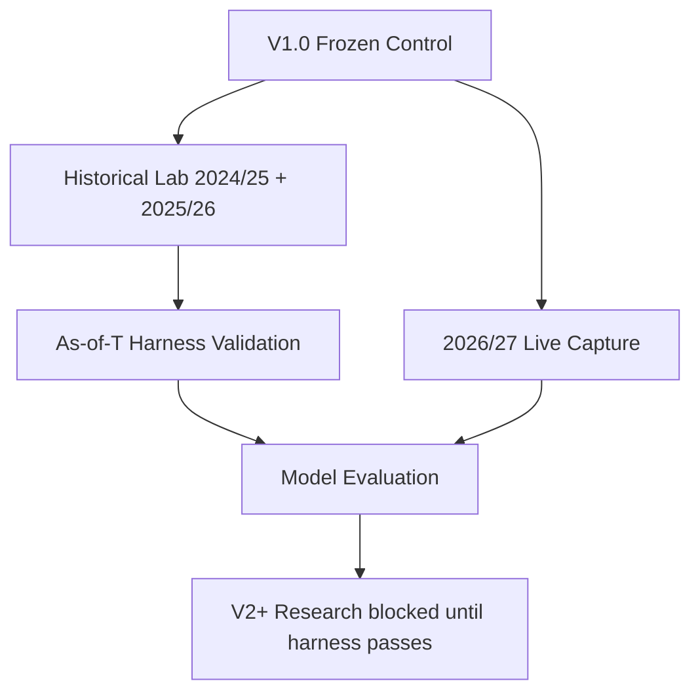

# Historical Harness Specification

> **A backtest result is not evidence until the harness has demonstrated that the
> prediction snapshot contains only information available at that point in time.**

This document defines the as-of-T historical reconstruction used by the Historical
Lab (2024/25 + 2025/26). It mirrors the live capture schema so scoring and
calibration infrastructure is shared.

---

## Three parallel tracks



---

## Data source

Vaastav Fantasy Premier League dataset (`data/vaastav/`).

Clone on first use:

```bash
python -c "from engine.harness import ensure_vaastav; ensure_vaastav()"
```

Required seasons:
- **2025/26** — primary historical lab (closest analogue to 2026/27)
- **2024/25** — confirmation season
- **2023/24** — prior-season stats for 2024/25 pre-GW1 reconstruction

---

## Field provenance (as-of GW N)

| V1 input | Allowed at prediction time | Source |
|---|---|---|
| Player identity / team | Yes | `players_raw.csv` (id, code, team) |
| Opening price for GW N | Yes | `gws/gw{N}.csv` `value` column |
| Prior-season per-90 rates | Yes | Previous season `gws/merged_gw.csv` aggregated by FPL `code` |
| Current-season cumulative stats | Only through GW N-1 | Current season merged GW files |
| Team strength | Yes (season-start) | `teams.csv` strength_overall_home/away |
| Fixtures for GW N | Yes, marked unfinished | `fixtures.csv` |
| `ep_next` / official xP | **Excluded** | Vaastav documents xP timing leakage risk |
| `chance_this` / `news` | **Excluded** | Not reliably timestamped historically |
| GW N actual points | **Scoring only** | `gws/gw{N}.csv` after freeze |

### Critical rule

Season-end `players_raw.csv` is **never** used as a GW1 snapshot. End-of-season
`now_cost`, `minutes`, and `total_points` contain future information. Opening
prices come from `gws/gw1.csv` `value`.

### Type-level cutoff vs provenance

Two different claims. Both are required. Neither implies the other.

| Layer | What it guarantees | What it does not |
|---|---|---|
| **Provenance / reconstruction** (this document, validation gates, E008) | The column was built from sources allowed at T | That a later Python function refuses extra fields |
| **Type-level cutoff** (`docs/FORMAL.md`, post-GW1) | A predictor of `Snapshot T` has no parameter for actuals at T or later | That allowed fields (e.g. B0 `xP`) were themselves pre-deadline |

A well-typed snapshot can still contain contaminated `xP`. A reconstructed
snapshot can still be passed to a function that also reads future files.
Use both.

Do not collapse prediction cutoff with evaluation-time flags:

| Artifact | May depend on | Must not depend on |
|---|---|---|
| Prediction from `Snapshot T` | fields permitted at cutoff T | actuals at T or later; post-deadline columns |
| `LeakFlag` (E008) | B0 `xP` and actuals | V1 / V2 / challenger scores |
| `evaluation_status` | fixtures, integrity, structure, optionally `LeakFlag` | model error, MAE, XI+Cap, regret |

`LeakFlag` is evaluation-time. It may see actuals. Prediction may not.

---

## Harness validation gates (pass/fail)

Run before any historical freeze:

```bash
python -m engine.harness_validate --season 2025-26 --gw 1
```

| Gate | Pre-GW1 | Rolling GW N |
|---|---|---|
| Player count >= 500 | required | required |
| `ep_next` is None for all players | required | required |
| Current-season minutes = 0 | required | must match sum through GW N-1 |
| Current-season points = 0 | required | must match sum through GW N-1 |
| Prices match GW opening `value` | required | required |
| Target GW fixtures exist and unfinished | required | required |
| `next_event` == target GW | required | required |

**Harness validation must PASS before historical results are treated as evidence.**

---

## Record schema (shared with live capture)

Live:

```text
records/gw01_v1.0.csv
```

Historical:

```text
records/historical/2025-26/gw01_v1.0.csv
records/historical/2024-25/gw01_v1.0.csv
```

Same columns. Same scoring via `engine/metrics.py`.

---

## Test ladder

### Test A — Preseason (GW1)

For each completed season:

```text
build_snapshot(season, as_of_gw=1) -> project -> freeze -> score vs GW1 actuals
```

Answers: does preseason methodology work?

### Test B — Rolling in-season

```text
for gw in 2..38:
    build_snapshot(season, as_of_gw=gw) -> project -> freeze -> score
```

Answers: does the update loop work without leakage?

```bash
python -m engine.harness_run --season 2025-26 --from-gw 1 --to-gw 38
python -m engine.harness_run --season 2025-26 --from-gw 1 --to-gw 38 --score
```

### Test C — Full season decision simulation

Optimizer manages squad GW1->GW38 with transfers. Requires V5 scope.
Not part of initial harness delivery.

---

## Baselines (B0-B3)

| ID | Source | Historical note |
|---|---|---|
| B0 | Official FPL xP | Exclude or lag — leakage risk |
| B1 | Last-season total points | Prior season aggregate |
| B2 | Naive points/90 (minutes>=900) | Prior season per-90 |
| B3 | V1 (current) | Harness-built snapshot |

Evaluate at **player level** (MAE, RMSE, Spearman, calibration) and
**decision level** (GW points, captain points, season points).

---

## Research sequence

1. **2025/26 GW1** — harness validate -> freeze -> score
2. **2024/25 GW1** — confirmation
3. Rolling GW1-38 for both seasons (Test B)
4. B0-B3 comparison report
5. Only then B4+ component experiments

V2+ research remains **blocked** until harness validation passes on both seasons.

---

## CLI reference

```bash
# Validate harness (must pass)
python -m engine.harness_validate --season 2025-26 --gw 1

# Freeze historical prediction
python -m engine.harness_run --season 2025-26 --gw 1

# Score after freeze
python -m engine.harness_run --season 2025-26 --gw 1 --score

# Batch rolling evaluation
python -m engine.harness_run --season 2025-26 --from-gw 1 --to-gw 5
python -m engine.harness_run --season 2025-26 --from-gw 1 --to-gw 5 --score
```

---

## Known approximations

| Field | Approximation | Risk |
|---|---|---|
| `status` / availability | Default `a` at pre-GW1 | Minutes model may overstate injured players |
| `selected_by` | Season-end `selected_by_percent` | Low impact on V1 projections |
| Set-piece orders | Season-end `players_raw` | Minor for GW1 |
| Team strength | Season-start FPL ratings | Acceptable for GW1 |
| DC per-90 | 0 for seasons without DC in merged_gw | DEF/MID DC understated in 2023/24 |

All approximations are documented so improvements can be gated individually.
